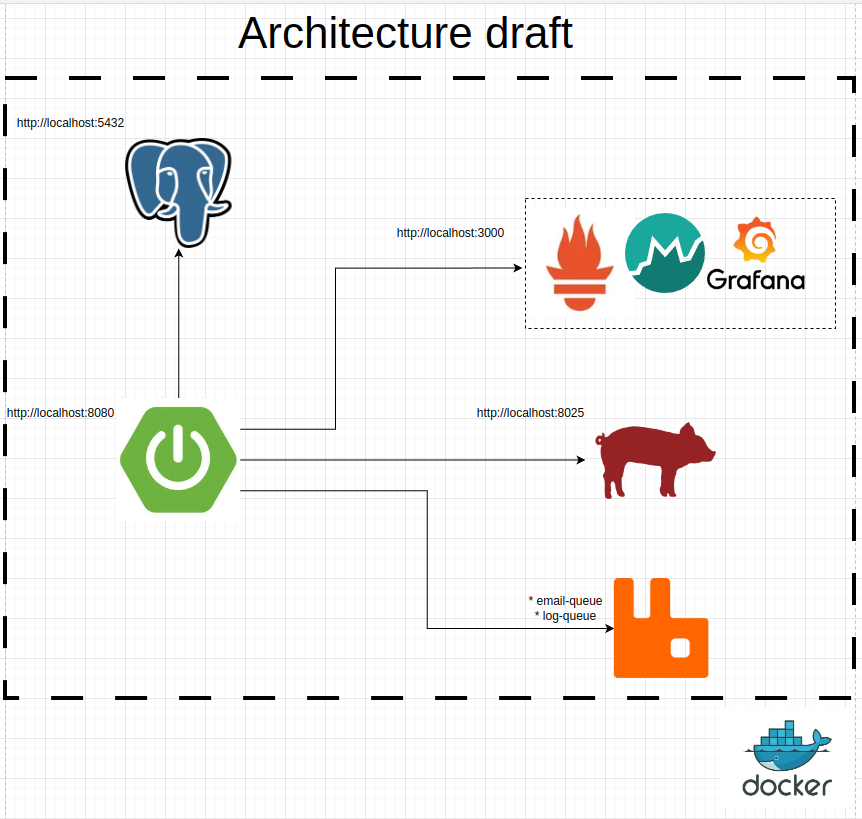
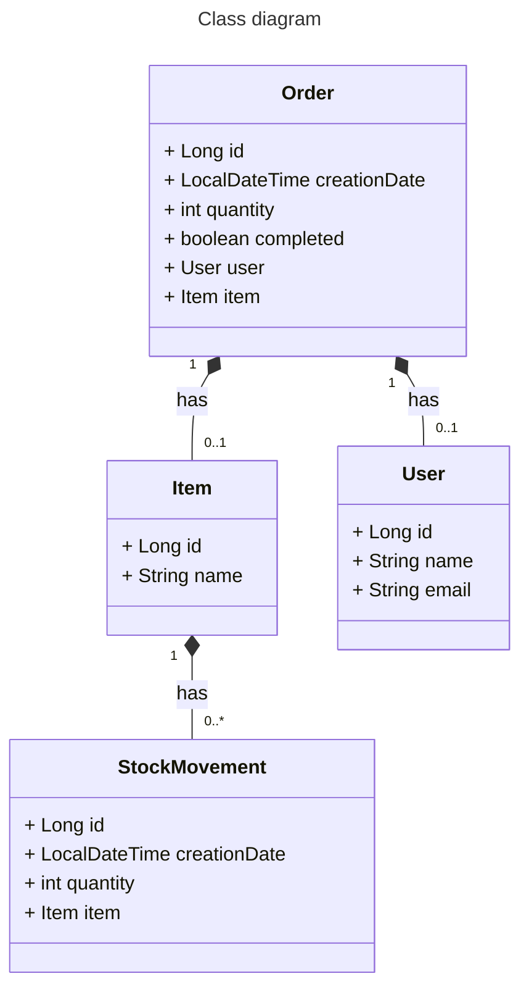

# ORDER MANAGER API

This is an order manager API that provide crud for all entities, save the application log
satisfy orders and stock movements and send e-mails when a order is completed

### Technologies

* Java 17;
* Springboot;
* Hibernate, Spring JPA;
* Docker, Docker Compose
* Postgres
* OpenApi(Swagger)
* Log4j, Lo
* Mapstruts
* Clean Architecture
* SOLID (I skip the letter S)
* RabbitMQ
* Prometheus, Grafana

### How to run

* Clone this repo
* Run on terminal docker-compose up
* API is available on http://localhost:8080/swagger-ui/index.html
* Emails can be checked on http://localhost:8025/
* Prometheus is available on http://localhost:9090/
* Grafana is available on http://localhost:3000/ | username: admin, password: admin
    * http://localhost:3000/d/spring_boot_21/spring-boot-2-1-system-monitor?orgId=1&refresh=5s

# Architecture

# Class Diagram

